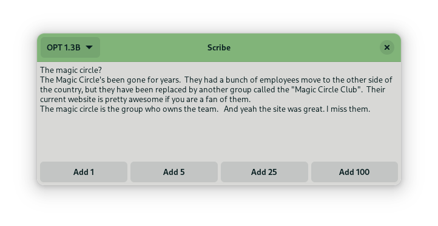

# Scribe

A small GUI tool for text generation.



The passage above was generated by the computer based on the first three words,
which were entered by hand. Scribe can also work without a prompt, in which
case it will create text about a random topic.

## Installation

You can run Scribe using the [Nix package manager](https://nixos.org/):

```sh
nix run github:danth/scribe
```

Or install it permanently by adding the flake to your NixOS configuration.

Alternatively, you can use standard Python tools, provided that you have
GTK4 development dependencies installed.

## Licensing

### Data

OPT-175B is licensed under the [OPT-175B license](https://github.com/facebookresearch/metaseq/blob/main/projects/OPT/MODEL_LICENSE.md),
Copyright (c) Meta Platforms, Inc. All Rights Reserved.

Note that commercial use is forbidden, among other restrictions.

### Code

[Transformers](https://github.com/huggingface/transformers) is licensed under the
[Apache 2.0 license](https://github.com/huggingface/transformers/blob/main/LICENSE).

[PyTorch](https://pytorch.org/) is licensed under a
[3-Clause BSD License](https://github.com/pytorch/pytorch/blob/master/LICENSE).

Scribe is licenced under the [GNU Affero General Public License 3.0](./LICENSE).
